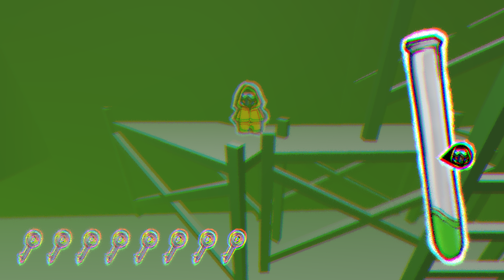

# Thorium

**Thorium** is a thrilling 3D platformer where horror and exploration meet. You're trapped in a nuclear power plant filling with hazardous radioactive waste. To escape, you must navigate through a dangerous environment, using keys to temporarily lower the rising waste levels and avoid deadly gears. The challenge intensifies as the waste level keeps rising...

### 🎮 How to Play

- **Move**: `WASD` or `Arrow Keys`
- **Jump**: `Space`
- **Use Key / Climb Ladders**: `G`
- **Goal**: Reach the key at the bottom of the chamber while avoiding gears and toxic waste, then escape through the exit door at the top of the chamber.

> Be cautious—the Occupational Safety and Health Administration would agree that your environment is anything but safe...

### 📸 Screenshots

 

### 🛠️ Installation

1. Visit the [Itch.io page](https://fayefzhang.itch.io/thorium) to download the game OR play the game in browser.
2. Unzip the downloaded file.
3. Run `Thorium.exe` (Windows) or the corresponding executable for your OS.

### 📖 Game Mechanics

- **Keys**: Use keys to temporarily lower the waste level and gain an advantage.
- **Ladders**: Climb up and down to navigate different areas.
- **Hazards**: Avoid gears and rising radioactive waste.

### 🧪 Development

This project was developed in a 24 hour period for UPGRADE's Fall 2024 Game Jam.

Programming: Robby, Faye, and Forest
Art: Christina, Faye, and Forest
Level Design: Faye, Christina, and Forest
Music and sound: Forest
Font: Nosifer

Check out our other great game, Girlboss Gaslight Gatekeep! Coming in 2025.
